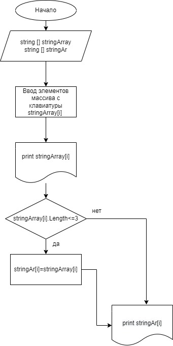

# Описание итоговой работы #

## Создание репозитория на github
Репозиторий создан, находится по адресу https://github.com/malina1606/First-part.git

## Блок схема алгоритма 

## Описание алгоритма

* По условиям задачи дан массив строк. Но я обьявляю еще один массив для сохранения в него элементов, удовлетворяюх условию задачи.
* Заполняется исходный массив введением с клавиатуры.
* Далее сраниваем длину каждого элемента с 3 - если длина элемента меньше или равна 3 символам, то записываю этот элемент в результирующий массив.
* Вывожу на экран результат.